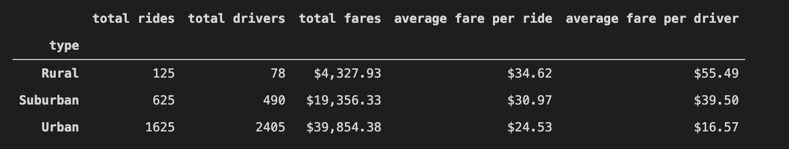

# pyber_analysis

### Resources 
data source: ride_data.csv, city_data.csv

software: jupyter notebook, python, visual studio code 

### Project Overview
Ride data was analyzed to give an overall picture of the differences in urban, suburban, and rural areas. This analysis was completed using data frames in conjunction with matplotlib to create graphs. The summary data frame shows the total rides, fares, and number of drivers as well as the average fare per ride and average fare per driver. It is broken down by city type urban, suburban, and rural. The line graph contains data from a selected time frame and highlights the differences in fare by city type. 

Stackoverflow was a tremendous resource for this project. The dates used were initially interpreted as a string, so a date time function was used to convert them from string to date-time. This allowed the values to be used with matplotlib to create a graph over a selected time period. The data read in from the csv file did not require any clean up. This may not always be the case and it is important to look over the csv file before beginning any analysis. 

Based on this data, the CEO of PyBer may want to reconsider spreading the ride sharing service to rural areas. Rural rides make up a small percentage of users, but they are the most expensive ride type. This most likely has to do with the fact that less people are using ride sharing services in rural areas, and a lack of demand for ride sharing services in rural areas. Additional analysis could be done with the ride ID’s to discover how many rides per day each driver was completing. A further analysis of the date-time values could also provide more insights such as which days of the week are most popular to use PyBer. This could allow the CEO to get more drivers on the road during busy times. Urban and suburban areas make up the core of the business and they should be focused on more heavily than rural areas.  

Yellow Line = Urban Cities

Red Line = Suburban Cities

Blue Line = Rural Cities

